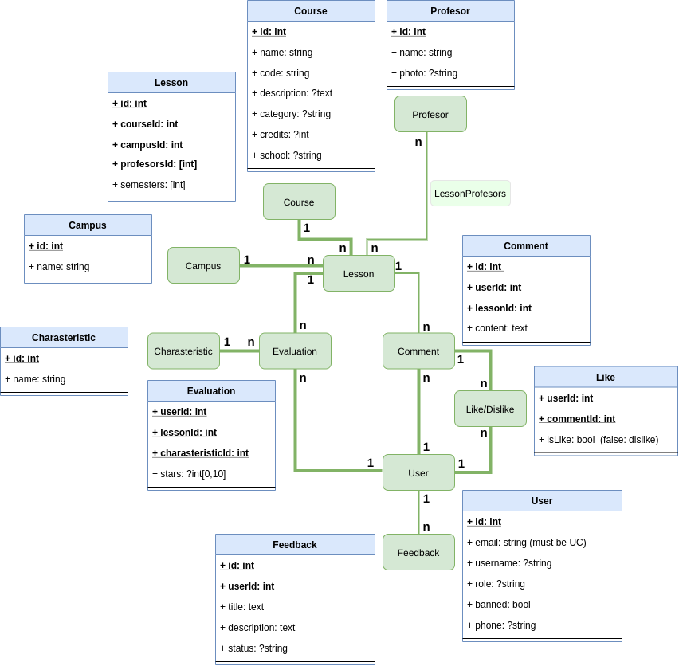

# evalua-uc
An open source project to evaluate Catholic University of Chile profesors and courses. 

### DB diagram 

You may not have access to this site
https://app.diagrams.net/#G1ZvuQQZ8PWtqlJSucXWYJ1vq-NFJxQkof

### Wireframe
Yo may not have access to this site
https://balsamiq.cloud/s7svhyi/pzsu39/rBD36

### Set-Up
git clone https://github.com/wayoalamos/evalua-uc-api.git
npm install express
npm install graphql
apt-get install postgresql
npm install pg-promise

### terminal commands to remember
psql -d postgres -U me         # connect to databse
\dt                            # list all tables
\c evalua-uc-api                

sudo kill `lsof -t -i:3000`

